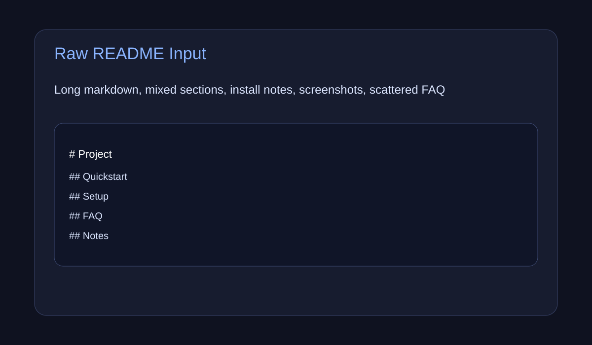
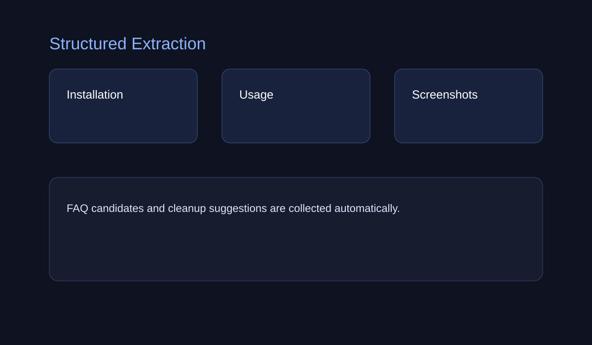
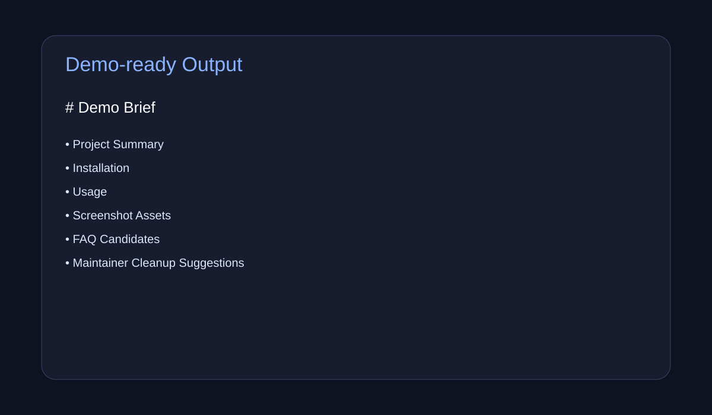

# readme-to-demo

Turn a raw GitHub README into a cleaner demo-oriented project brief.

> Extract installation, run steps, screenshots, FAQ candidates, and a launch-friendly summary from messy repository documentation.

---

## The problem

Many open-source repositories have useful information, but it is buried inside long READMEs, inconsistent sections, or weak structure.

That creates friction for:

- first-time users,
- reviewers,
- contributors,
- and maintainers trying to present the project clearly.

`readme-to-demo` helps convert raw README content into a more demo-friendly structure that is easier to scan, explain, and reuse.

---

## Demo Preview

<table>
<tr>
<td></td>
<td></td>
<td></td>
</tr>
</table>

### Demo flow
1. Paste a README file or local markdown path
2. Extract key operational sections
3. Output a cleaner demo-ready markdown summary

---

## 3-step how it works

### 1) Parse the README
The tool reads markdown input and scans for operational sections such as installation, usage, screenshots, examples, and FAQ-like content.

### 2) Normalize the structure
It groups useful content into a stable public-repo format:

- project summary
- install steps
- run steps
- demo assets
- FAQ candidates

### 3) Generate a demo-ready brief
It outputs a markdown file that is easier to use for project landing pages, launch docs, quick demos, and contributor onboarding.

---

## Sample scenario

**Input:** a long README with mixed sections, screenshots, setup commands, and scattered notes.

**Output:** a shorter markdown brief with:
- one-paragraph summary,
- install block,
- run block,
- screenshot section,
- FAQ candidates,
- maintainers' next cleanup suggestions.

---

## Quickstart

```bash
PYTHONPATH=src python3 -m readme_to_demo.cli convert README.md --output demo-brief.md
```

---

## Why this project exists

The open-source ecosystem has a documentation quality gap.
Even strong repos often underperform because their README is hard to scan, hard to demo, or hard to translate into a launch-friendly structure.

This project aims to make public repository presentation more reproducible.

---

## Product direction

This project is intended to become a lightweight documentation utility for open-source launches.

### Direction 1 — Documentation as infrastructure
README quality affects adoption, trust, sharing, and contributor conversion. It should be treated as infrastructure, not decoration.

### Direction 2 — Small tool, high leverage
The tool should remain lightweight, scriptable, and easy to integrate into maintainer workflows.

### Direction 3 — Demo-first repository hygiene
The output should help maintainers prepare:
- launch pages,
- quickstart docs,
- GitHub landing sections,
- project showcase summaries.

### Direction 4 — Extendable extraction model
Long term, this can expand into:
- issue template suggestions,
- release-note drafting,
- screenshot inventory extraction,
- repo launch checklist generation.

---

## MVP scope

Current MVP includes:
- markdown file input
- lightweight heading-based extraction
- summary sections for install, usage, screenshots, and FAQ candidates
- markdown output generation

Near-term additions:
- README URL fetch support
- richer section detection
- launch checklist generation
- template styles for different repo types

---

## Repository structure

```text
readme-to-demo/
├─ README.md
├─ pyproject.toml
├─ src/readme_to_demo/
│  ├─ __init__.py
│  ├─ extractor.py
│  └─ cli.py
├─ docs/assets/
│  ├─ screenshot-1.svg
│  ├─ screenshot-2.svg
│  └─ screenshot-3.svg
└─ .github/workflows/ci.yml
```

---

## Roadmap

### Phase 1
- local markdown input
- section extraction
- demo brief markdown output

### Phase 2
- README URL support
- better command block extraction
- structured FAQ generation

### Phase 3
- repo-type presets
- launch checklist generation
- screenshot inventory report

### Phase 4
- web UI
- batch mode for multiple repos
- maintainers' documentation scoring

---

## License

MIT
